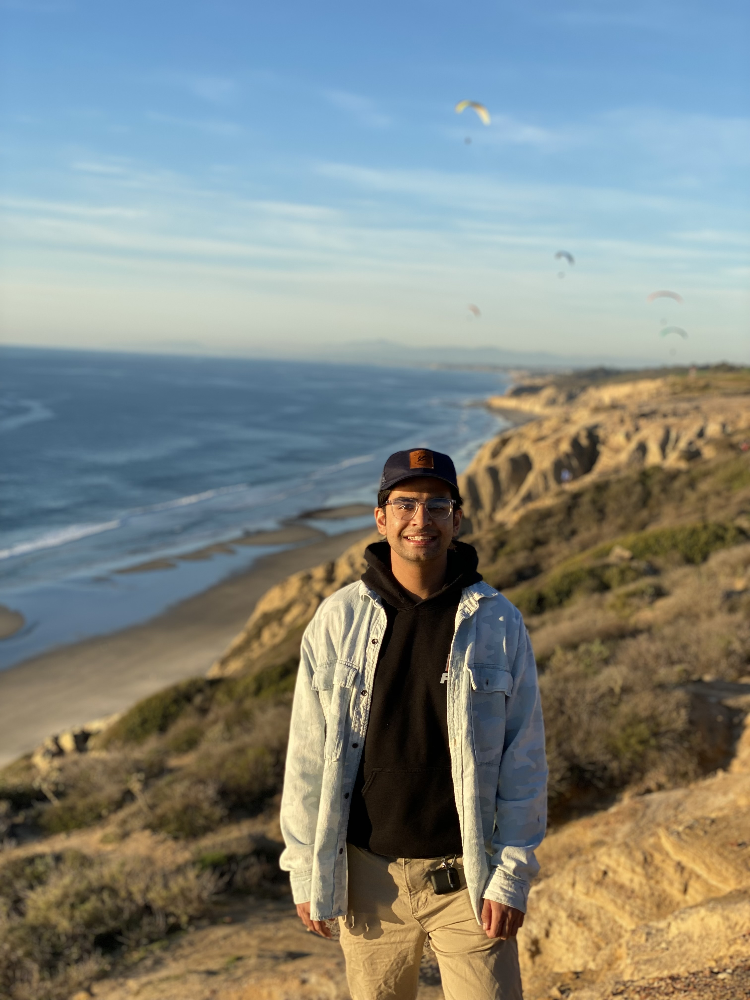

# Younus Ahmad
>**“We cannot solve problems with the kind of thinking we employed when we came up with them.” — Albert Einstein**

## About Me

My name is Younus and I am a 3rd year Computer Engineering major in 7th college. I am from Fresno, CA and have an incredibly strong passion to learn about as many things as I can (there's a lot of cool stuff in the world!). Some fields that I'm interested in are **Machine Learning**, to which I've done some projects in with campus organizations. Specifically these projects included image and text classification using **Natural Language Processing**. I am also super interested in software development, and have had only a limited experience in using **React**, but I hope to increase my practice while taking CSE 110.

## Interests
- I absolutely love the outdoors and spending time in nature. I am from Fresno so my family and I frequently hike at Yosemite and the Seqoias. I also love spending hot summer days at lakes, Lake Tahoe being my favorite. Here's some pictures of hikes I've completed: 

INCLUDE PICS OF HIKES HERE

## Projects

### 1. E4E: Radio Telemetry Tracker
- sadfsd
- sdfsdf
- sdfsd
### 2. Bird Classification
- sfsdf
- sdfsdf
- sdfsd
### 3. COVID Sentiment Tweet Analyzer
- sdfsdf
- ssdfsd
- sdfsdf

## Links
- [Github](https://github.com/yahmad3495)

