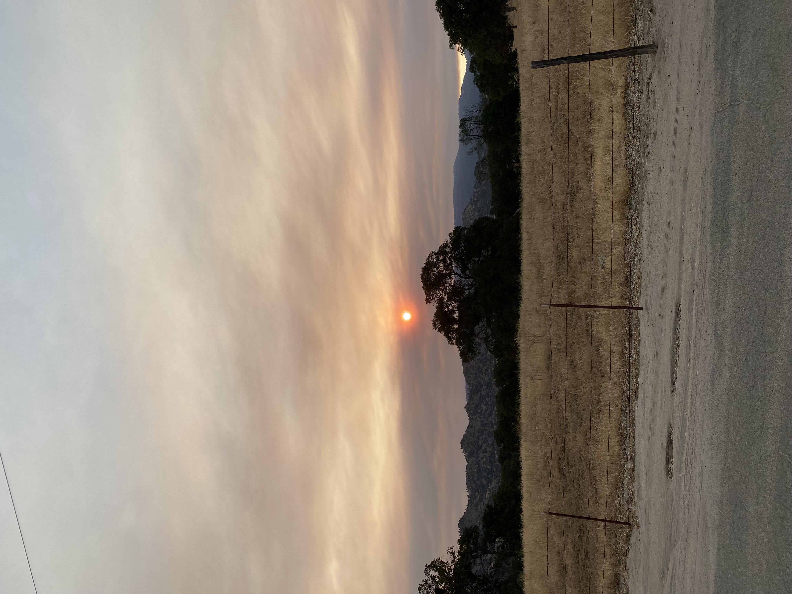
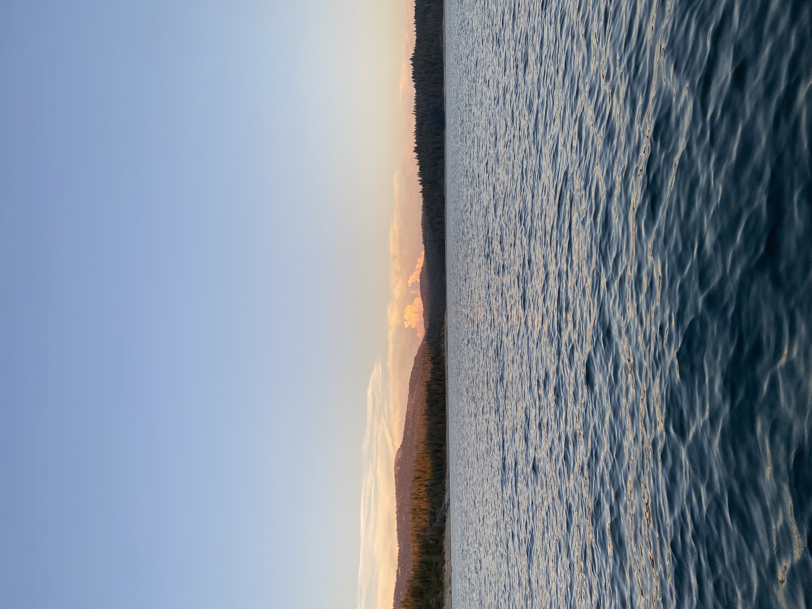

# Younus Ahmad
>**“We cannot solve problems with the kind of thinking we employed when we came up with them.” — Albert Einstein**

`print(Hello World!)`
## About Me

My name is Younus and I am a 3rd year Computer Engineering major in 7th college. I am from Fresno, CA and have an incredibly strong passion to learn about as many things as I can (there's a lot of cool stuff in the world!). Some fields that I'm interested in are **Machine Learning**, to which I've done some projects in with campus organizations. Specifically these projects included image and text classification using **Natural Language Processing**. I am also super interested in software development, and have had only a limited experience in using **React**, but I hope to increase my practice while taking CSE 110.

[Interests](#interests) [Projects](#projects) [Links](#links)

## Interests
- I absolutely love the outdoors and spending time in nature. I am from Fresno so my family and I frequently hike at Yosemite and the Seqoias. I also love spending hot summer days at lakes, Lake Tahoe being my favorite. Here's some pictures of hikes I've completed: 

    

        
    

    

        
    

    

        
    

- I love to play sports, although I'm not the greatest. I have the most fun playing badminton and ping pong, but also enjoy to play basketball, baseball, soccer, and football.

- I enjoy videogames when I don't have much going on. Some of my favorites are God of War 4, The Witcher 3, League of Legends and Valorant

-I love movies, TV shows, and anime. Super hard to pick favorites, but I really enjoyed Attack on Titan a lot.

## Goals
- [ ] Hit Radiant in Valorant
- [ ] Work at google and make 7 figures in year
- [ ] Travel to at least 5 other countries
- [ ] Become the best programmer in all of existence

## Projects

### 1. E4E: Radio Telemetry Tracker
- This project was aimed at helping researchers at the San Diego monitor animal movement patterns.
- A drone set on an computer generated flight path would use radio waves to communicate with trackers placed on animals, creating pings of where animals were last located. 
- I helped develop additional features to be added onto the GUI, specifically more map navigation tools and more exportation tool.
### 2. Bird Classification
- Used an existing Kaggle database to feed into a Convolutional Neural Network to classify bird images based on their species.
- This project was done as a part of ACM projects so I worked with a group of undergrads also interested in learning machine learning. It was a relatively basic project, but the experience gave me a lot of insight into the typical machine learning pipeline.
### 3. COVID Sentiment Tweet Analyzer
- This project was done as a final project for the UCSD SPIS program. The idea was to try and identify whether a tweet contained false information about the COVID-19 pandemic. It was done at the height of the pandemic, where political differences lead to multiple counts of misinformation about coronavirus being spread, so my partner and I decided it would be a cool idea to try and indentify this.
- Used a lot of NLP and Recurrent Neural Networks (RNN) to actually do the text classification.
- Created a twitter bot that would work towards scraping tweets that were about coronavirus. This was done primarily using Python Regex.

## Links
[Github](https://github.com/yahmad3495)
[Linkedin](https://www.linkedin.com/in/younus-ahmad-64a1521b2/)

